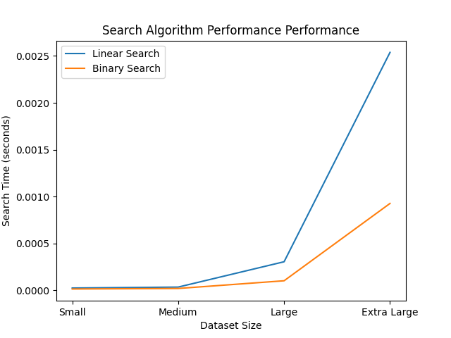

# seng-313-midterm-project

my midterm project of Analysis of Algorithms lecture.

## customer order with merge sort and quick sort

## product search for online store with binary search and linear search

## things to add

- explanation part in detail
- better the durations of the graphs and the details of the graph
- requirements for virtual env
- try to write the code more clean
